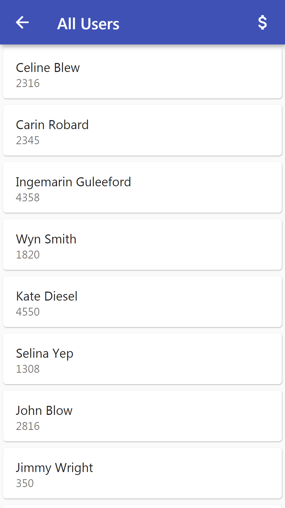
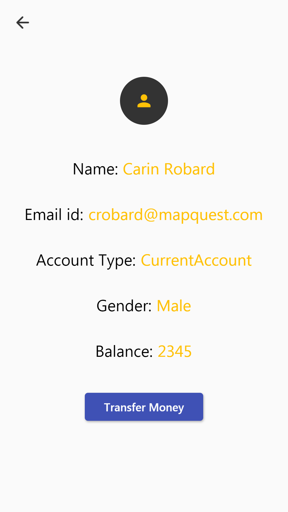
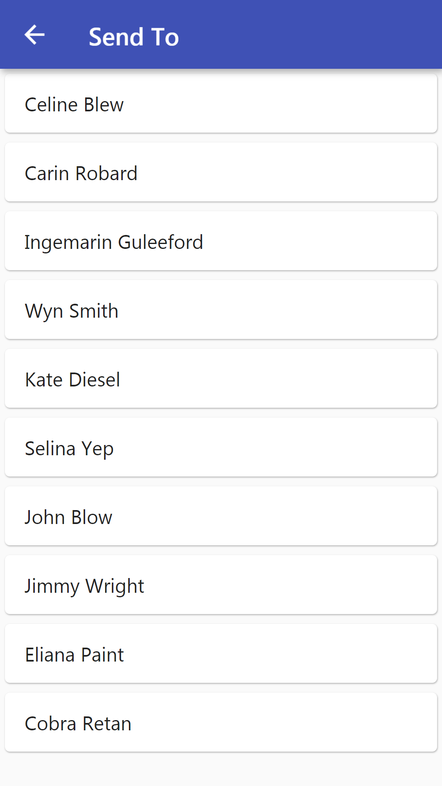
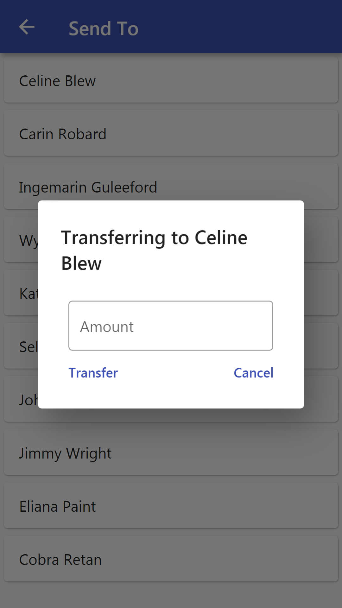
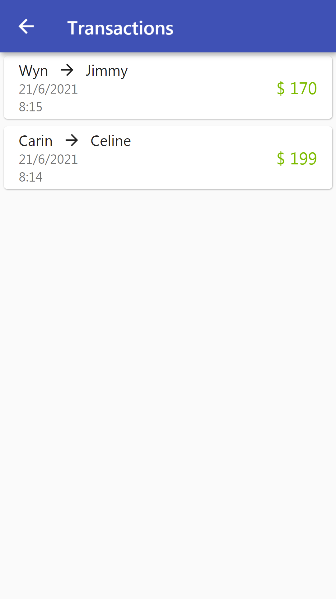

# The_Basic_Banking_App
This is the submission for The Spark Foundation's Internship Program. 
The Domain was Mobile App Development.

## About Task
  1. Create a simple mobile app which has the following specs. 
  2. Start with creating dummy data in mobile database for upto 10 users. User table will have basic fields such as name, email, current balance etc. Transfers table will record all transfers happened. 
  3. Flow: Home Screen > View all Customers> Select and View one Customer> Transfer Money> Select customer to transfer to > View all Customers. 
  4. No Login Page. No Customer Creation. Only transfer of money between multiple customers.

## Technologies Used
  - FrontEnd and BackEnd : Flutter and Dart 
  - DataBase : Hive 

## Packages Used
  - Dependencies 
    1. hive_flutter: ^1.0.0 
    2. hive: ^2.0.4 
    3. shared_preferences: ^2.0.6 
  - Dev_Dependencies 
    1. build_runner: ^2.0.4
    2. hive_generator: ^1.1.0
    3. flutter_native_splash: ^1.2.0
    
## Snapshots
  1. Homepage 
  
  
  2. All Customer Page 
     Shows the customer's list.
  
  
  3. Detail Page 
  Shows detail of customer. 
  
  
  4. Select Customer Page 
  Selection of Receiver 
  
  
  5. Payment Page 
  Entering transferring amount 
  
  
  6. Transaction Page 
  Shows the all the previos transactions. 
  
